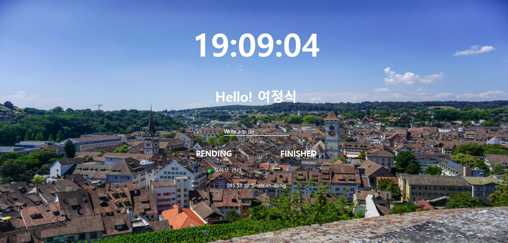
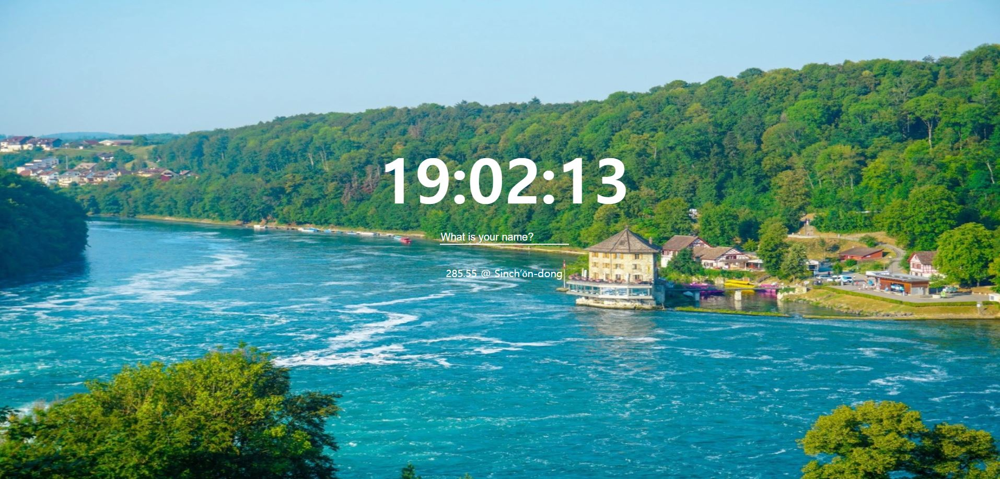
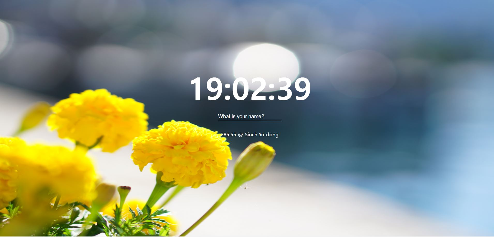
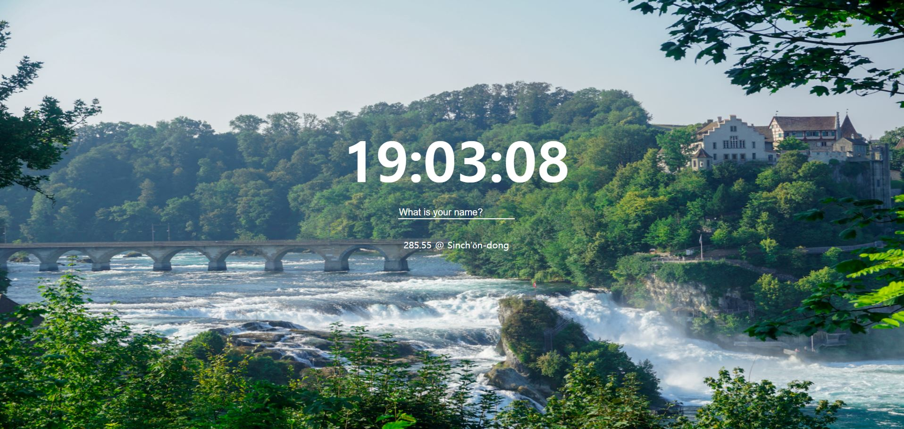

# chrome-app
 바닐라JS 크롬 To-Do List 앱

```json
{
    "name":"Javascript for Beginners",
    "skills": [
        "Javascript",
        "localStorage",
        "AJAX",
        "JSON",
        "DOM",
        "fetch",
        "OpenWeather API"
    ]
}
```

## 이론
- Variables
- Functions
- Data Types
- Arrays, Objects
- DOM Functions
- Events
- if / else / for

## 기능
- JS Clock
- JS To Do List
- Get Geolocation
- Get Weather Information
- Deploy to Github Pages

## 스크린샷










